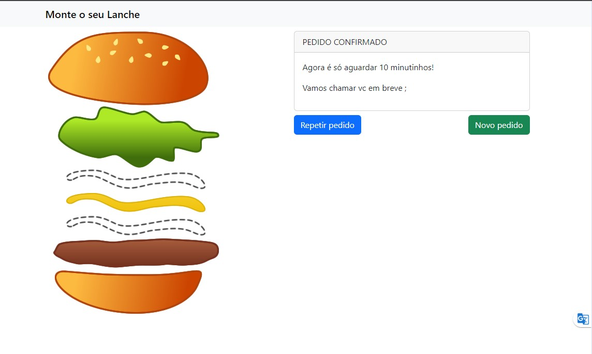

# projeto-montando-o-lanche-VueJs
Projeto básico de estudos VueJs - Montando o lanche
#


- Etapa 1


   ##

- Etapa 2


   ##

- Etapa 3


## Prerequisites

✔ - Node 18.10.0
✔ - Visual Code
✔ - Extensão Live Server

## Quick Start

```
  
Executar o arquivo index.html através do Live Server
  
```
